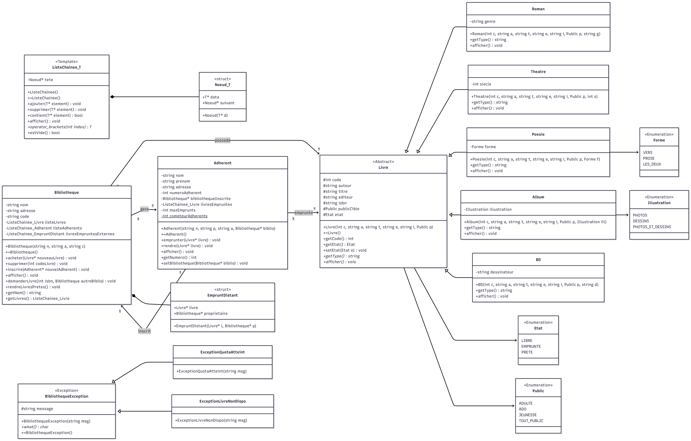

# Gestion_Bibliothèques
Projet final (fait en binôme) pour l'électif de programmation orientée objet en C++. L'objectif de ce projet était de fournir un programme qui permette de gérer un réseau de bibliothèques. Il s'agit donc de représenter les différentes bibliothèques ainsi que leur contenu, leurs adhérents, les emprunts, les échanges entre bibliothèques, les achats, les pertes et la mise au pilon de certains ouvrages.

---

## Fonctionnalités

* Gestion d’un catalogue de livres
* Gestion des adhérents
* Emprunt et retour de livres
* Gestion des quotas d’emprunt
* Prêts entre bibliothèques
* Gestion des erreurs via exceptions personnalisées
* Interface console interactive
* Implémentation d’une structure de données générique `ListeChainee<T>`

---

## Concepts C++ utilisés

| Concept                | Utilisation                                           |
| ---------------------- | ----------------------------------------------------- |
| Templates              | `ListeChainee<T>`                                     |
| Héritage               | `Livre` → `Roman`, `Theatre`, `Poesie`, `Album`, `BD` |
| Polymorphisme          | Méthodes virtuelles pures                             |
| Exceptions             | Hiérarchie `BibliothequeException`                    |
| Surcharge d’opérateurs | `operator[]`, `operator<<`                            |
| Membres statiques      | Génération automatique des numéros d’adhérents        |
| Fonctions amies        | Affichage personnalisé                                |

---

## Architecture du projet

### Classe abstraite `Livre`

La classe `Livre` définit les caractéristiques communes à tous les ouvrages :

* titre
* auteur
* ISBN
* éditeur
* public cible
* état du livre

Elle est spécialisée par plusieurs types de livres :

* `Roman`
* `Theatre`
* `Poesie`
* `Album`
* `BD`

---

### `Bibliotheque`

Classe centrale du projet :

* gestion du stock
* gestion des adhérents
* gestion des emprunts
* échanges entre bibliothèques

---

### `Adherent`

Représente un utilisateur inscrit pouvant :

* emprunter des livres
* rendre des livres
* respecter un quota maximal d’emprunts

---

### `ListeChainee<T>`

Structure de données générique développée pour le projet :

* insertion
* suppression
* accès par index
* surcharge d’opérateurs

---

## Structure actuelle du projet

Le projet contient actuellement :

* les fichiers `.h` et `.cpp`
* plusieurs fichiers `main`
* un diagramme UML (`.png`)
* un PDF documentant un peu plus en détails les différentes classes

---

## Compilation

Le projet est compilé avec **g++** sous **VSCode**.

Attention, plusieurs fichiers de type `main` sont présents dans le projet.
Il faut compiler **un seul fichier `main` à la fois** afin d’éviter les erreurs de liens dues aux multiples points d’entrée.

---

## Modes disponibles

Le projet contient actuellement trois programmes principaux :

| Main          | Description                                 |
| ------------- | ------------------------------------------- |
| test_classes  | Tests des classes                           |
| test_methodes | Tests complets des méthodes                 |
| main          | Interface utilisateur console interactive   |

---

## Diagramme UML

Le projet contient également un diagramme UML représentant l’architecture des classes.

  

---

## Auteur

Projet réalisé par :

* Romane Tissot
* Titouan Plaisir

Dans le cadre de l’électif de Programmation Orientée Objet en C++.
